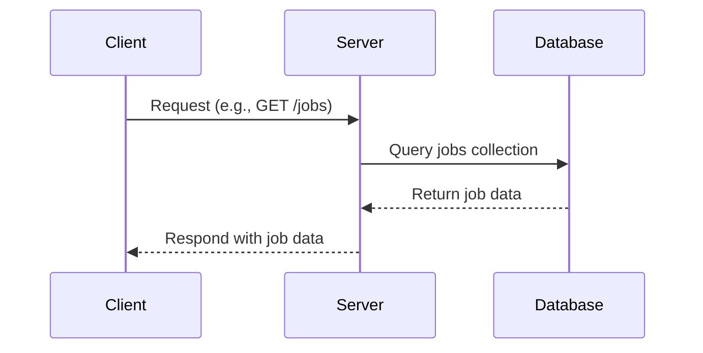
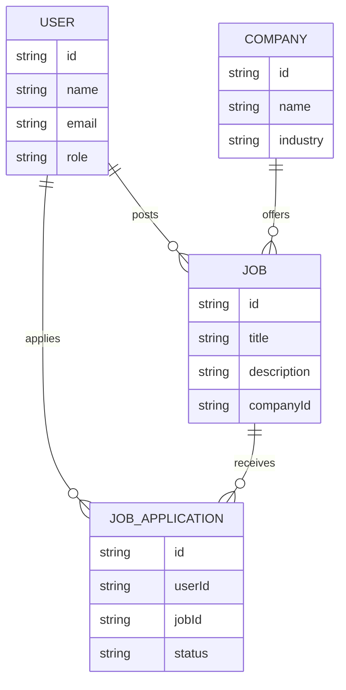

# Architecture Overview

This project follows a client-server-database model, enabling scalable and maintainable development. The client (frontend) communicates with the server (backend API), which in turn interacts with the database to store and retrieve application data. This separation of concerns ensures modularity, security, and efficient data flow throughout the system.

## System Diagram

```mermaid
%% System Overview
flowchart LR
    Client[Client (React)] -->|HTTP| Server[Server (Express API)]
    Server -->|CRUD| Database[(MongoDB)]
```

## Client → API → DB Flow



## Entity-Relationship Diagram


