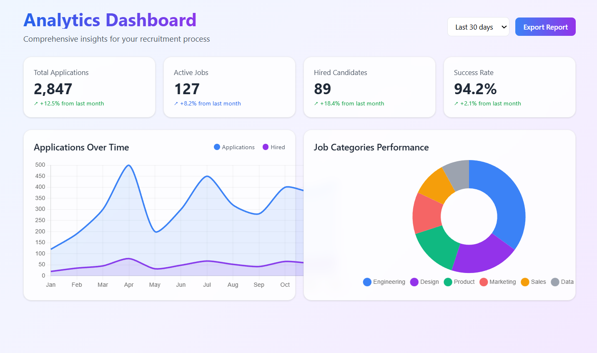

> 💼 **HireFlow AI** is a modern, AI-powered hiring platform that bridges the gap between job seekers and employers through **intelligent matching** and **real-time collaboration**.  
> Built with cutting-edge technologies to **streamline recruitment** and improve **hiring outcomes**.

---

## 🧠 Tech Stack

### 🖥️ Frontend

- ⚛️ **React 18** – Modern JavaScript library for building dynamic UIs  
- 🧭 **Next.js** – Full-stack React framework with SSR & API routes  
- 🧩 **TypeScript** – Static type checking for enhanced developer experience  
- 🎨 **Tailwind CSS** – Utility-first CSS framework for rapid UI development  

### ⚙️ Backend

- 🟢 **Node.js** – JavaScript runtime for server-side development  
- 🚀 **Express.js** – Fast, unopinionated web framework for Node.js  
- 🍃 **MongoDB** – NoSQL database for flexible data storage  
- 🐘 **PostgreSQL** – Relational database for structured data  

### 🧰 Development & Deployment

- ⚡ **Vite** – Fast build tool and development server  
- ✅ **ESLint** – Code linting and quality assurance  
- 🧪 **Jest** – Testing framework for unit and integration tests  

---

## 🏗️ Setup Guide

### 📋 Prerequisites

Make sure you have installed:

- **Node.js** ≥ 18.0.0  
- **npm** ≥ 9.0.0  
- **Git**  

---

### 🧩 Local Installation

1. Clone the repository  
   ```bash
   git clone https://github.com/AnsariTech-25667/HireFlow-AI.git
   cd HireFlow-AI
````

2. Setup environment variables

   ```bash
   cp .env.example .env
   # Edit .env with your configuration
   ```

3. Start development server

   ```bash
   npm run dev
   ```

---

## 🌍 Environment Variables

Create a `.env` file in the project root and configure:

| Variable                | Description                    | Required | Example                 |
| ----------------------- | ------------------------------ | -------- | ----------------------- |
| `PORT`                  | Server port number             | ❌        | `4000`                  |
| `CLIENT_URL`            | Frontend application URL       | ✅        | `http://localhost:5173` |
| `OPENAI_API_KEY`        | OpenAI API key for AI features | ❌        | `sk-...`                |
| `CLOUDINARY_CLOUD_NAME` | Cloudinary cloud name          | ❌        | `your-cloud-name`       |
| `CLOUDINARY_API_KEY`    | Cloudinary API key             | ❌        | `123456789`             |
| `CLOUDINARY_API_SECRET` | Cloudinary API secret          | ❌        | `your-api-secret`       |

### 🔑 Obtaining API Keys

* 🗄️ **MongoDB Atlas**
* 🧠 **OpenAI Platform**
* ☁️ **Cloudinary**

---

## 🧪 Scripts

| Command                | Description                                          |
| ---------------------- | ---------------------------------------------------- |
| `npm run dev`          | Start development servers for both client and server |
| `npm run build`        | Build client for production                          |
| `npm test`             | Run test suites                                      |
| `npm run client:dev`   | Start client only in development mode                |
| `npm run server:dev`   | Start server only in development mode                |
| `npm run client:build` | Build the client application                         |
| `npm run client:test`  | Run only client-side tests                           |
| `npm run server:test`  | Run only server-side tests                           |

---

## 🖼️ Project Gallery

Here’s a glimpse of **HireFlow AI** in action 💡

* **Landing Page**
  

* **Analytics Dashboard**
  

* **Job Cards**
  

---

## 🚀 Deployment

> ⚙️ *Coming Soon:* Production deployment instructions for hosting and scaling HireFlow AI.

---

## 🧩 Development Approach

HireFlow AI follows a modular, scalable, and AI-first architecture — enabling rapid iteration and seamless integration of intelligent matching features.
📚 **Read More:** [DEVELOPMENT.md](DEVELOPMENT.md)

---

## 🔐 Security

We take security **very seriously**.
If you discover a vulnerability, please follow our responsible disclosure policy.
📋 **Security Policy:** [SECURITY.md](SECURITY.md)

### 📝 Reporting Security Issues

* 📧 **Email:** [maazansari25667@gmail.com](mailto:maazansari25667@gmail.com)
* 🚫 **Do NOT** create public issues for vulnerabilities
* Include steps to reproduce & impact assessment

### 🛡️ Security Features

* 🔒 Automated Secret Scanning (pre-commit hooks)
* 🛡️ Dependency Auditing & Vulnerability Checks
* 🔐 Input Validation & Data Sanitization
* 📊 Real-Time Security Monitoring

---

## 📜 License

This project is licensed under the **MIT License** — see the [LICENSE](LICENSE) file for details.

---

### 💖 Built with Passion

> Built with modern web technologies, scalable architecture, and enterprise-grade security.
> Empowering smarter, faster, and fairer hiring — powered by AI. 🤖✨

```
