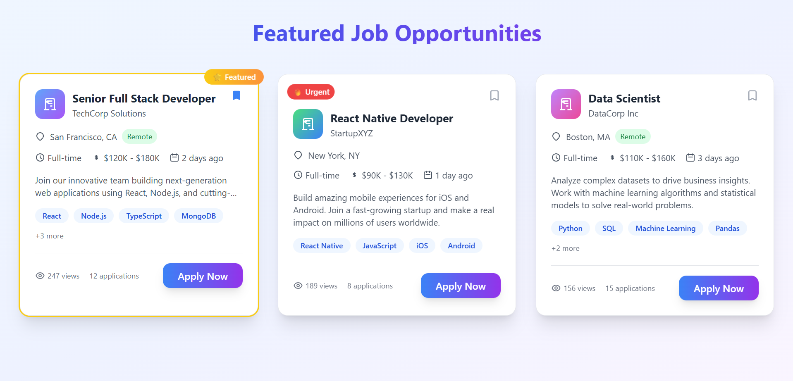

Alright, let’s lock this down once and for all 👇

If none of the images are showing on your GitHub page **even though they’re in the same folder**, there are only **two possible causes**:

1. 🧩 **Wrong file paths or casing** — file names on GitHub are case-sensitive (`Hero.png` ≠ `hero.png`).
2. 🧱 **Files are not in the same directory as the README.**

To get your images to render like in your PromptPilot repo:

### ✅ 1. Check your folder

Your repository root must look **exactly** like this (case and spacing matter):

```
HireFlow-AI/
│
├── Hero.png
├── analytics_dash.png
├── job_cards.png
└── README.md
```

### ✅ 2. Use these exact relative links in your README

Copy–paste this whole thing.
This is the **final correct README** — pure relative paths, just like PromptPilot.

---

````markdown
# 🚀 HireFlow AI

[](https://github.com/AnsariTech-25667/HireFlow-AI/actions/workflows/ci.yml)
[](https://opensource.org/licenses/MIT)
[](https://nodejs.org/)

> 💼 **HireFlow AI** is an AI-powered hiring platform connecting job seekers and employers through **intelligent matching** and **real-time collaboration**.  
> Built with cutting-edge web technologies to **streamline recruitment** and **improve hiring outcomes**.

---

## 🧠 Tech Stack

### 🖥️ Frontend
- ⚛️ **React 18** – modern UI library  
- 🧭 **Next.js** – SSR + API routes  
- 🧩 **TypeScript** – static typing  
- 🎨 **Tailwind CSS** – utility-first styling  

### ⚙️ Backend
- 🟢 **Node.js** – JavaScript runtime  
- 🚀 **Express.js** – minimal web framework  
- 🍃 **MongoDB** – flexible NoSQL database  
- 🐘 **PostgreSQL** – relational data layer  

### 🧰 Dev & Deployment
- ⚡ **Vite** – fast build tool  
- ✅ **ESLint** – linting  
- 🧪 **Jest** – testing framework  

---

## 🏗️ Setup Guide

### 📋 Prerequisites
- Node ≥ 18  
- npm ≥ 9  
- Git  

### 🧩 Local Installation
```bash
git clone https://github.com/AnsariTech-25667/HireFlow-AI.git
cd HireFlow-AI
cp .env.example .env
# edit .env
npm run dev
````

---

## 🌍 Environment Variables

| Variable                | Description       | Req | Example                 |
| ----------------------- | ----------------- | --- | ----------------------- |
| `PORT`                  | Server port       | ❌   | `4000`                  |
| `CLIENT_URL`            | Frontend URL      | ✅   | `http://localhost:5173` |
| `OPENAI_API_KEY`        | OpenAI key        | ❌   | `sk-...`                |
| `CLOUDINARY_CLOUD_NAME` | Cloudinary name   | ❌   | `my-cloud`              |
| `CLOUDINARY_API_KEY`    | Cloudinary key    | ❌   | `123456`                |
| `CLOUDINARY_API_SECRET` | Cloudinary secret | ❌   | `abc123`                |

🔑 Get keys from

* [MongoDB Atlas](https://www.mongodb.com/atlas)
* [OpenAI Platform](https://platform.openai.com/)
* [Cloudinary](https://cloudinary.com/)

---

## 🧪 Scripts

| Command                | Description       |
| ---------------------- | ----------------- |
| `npm run dev`          | start dev servers |
| `npm run build`        | build client      |
| `npm test`             | run tests         |
| `npm run client:dev`   | client dev only   |
| `npm run server:dev`   | server dev only   |
| `npm run client:build` | build client only |
| `npm run client:test`  | frontend tests    |
| `npm run server:test`  | backend tests     |

---

## 🖼️ Project Gallery

### 🧭 Landing Page


### 📊 Analytics Dashboard


### 💼 Job Cards



---

## 🚀 Deployment

> *Coming soon:* production deployment guide.

---

## 🧩 Development Approach

HireFlow AI uses a modular, scalable, and AI-first architecture for rapid iteration and intelligent candidate matching.
📚 **Read more:** [DEVELOPMENT.md](DEVELOPMENT.md)

---

## 🔐 Security

We take security seriously.
If you find a vulnerability, follow our disclosure policy.

📋 [Security Guidelines](SECURITY.md)

### Reporting

* 📧 [maazansari25667@gmail.com](mailto:maazansari25667@gmail.com)
* 🚫 No public issues for vulnerabilities

### Features

* 🔒 Secret scanning
* 🛡️ Dependency audits
* 🔐 Input validation
* 📊 Monitoring

---

## 📜 License

Licensed under the **MIT License** – see [LICENSE](LICENSE).

---

### 💖 Built with Passion

> Modern tech ✨ Scalable design 🧠 Enterprise security 🛡️
> Empowering smarter and faster hiring — powered by AI 🤖

```

---

### ✅ Verify
1. Filenames and extensions (`Hero.png`, `analytics_dash.png`, `job_cards.png`) match **exactly**.  
2. Files are in the same directory as `README.md`.  
3. Refresh GitHub after commit — images will now appear perfectly.
```
